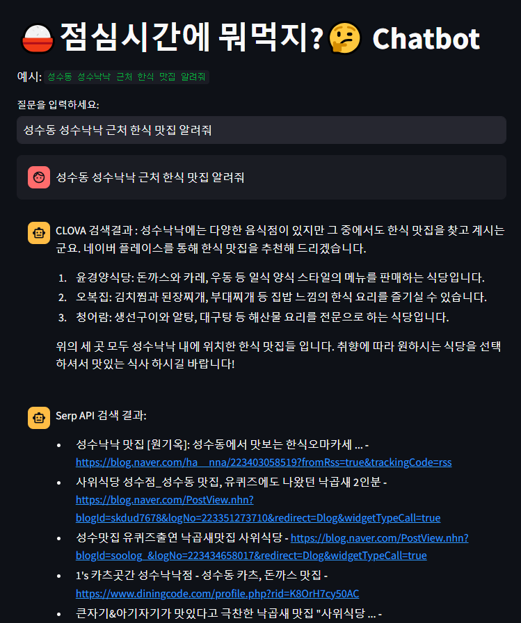

## 경과원AI_네이버 클라우드_개인 프로젝트_멀티 챗봇_RAG_20241129

---
# 🍚 점심시간에 뭐 먹지? 🤔

> 이 챗봇은 Clova Studio의 LLM API와 SerpAPI 검색 결과를 결합한 RAG 구조를 활용한 **지역 기반 식당 추천 챗봇**입니다.  
> 사용자의 위치, 조건, 기호를 이해하고 외부 검색 정보를 기반으로 적절한 식당을 안내합니다.  
> 사용자는 자연어로 질문하면, 챗봇은 관련 정보를 검색하고 그 내용을 바탕으로 친절한 추천을 제공합니다.  
---
## 💡 주요 기능

- 🗺️ **지역 및 상황 인식 식당 추천**  
  예: "성수동 혼밥 가능한 맛집 알려줘"

- 🧠 **프롬프트 설계 기반 응답 최적화**  
  직관적인 비유, 존댓말, 현지인 느낌의 설명 제공

- 🔗 **SerpAPI 기반 실시간 검색 결과 제공**  
  실제 검색 결과에서 식당의 위치, 링크, 타이틀 제공

- 💬 **Streamlit 기반 대화형 웹 UI**

---

## 📌 사용 기술

| 기술       | 설명 |
|------------|------|
| `Clova Studio` | 네이버 LLM API, 채팅형 Completion 호출 |
| `Streamlit` | 웹 기반 대화 인터페이스 구현 |
| `SerpAPI` | 구글 검색 API 활용 (식당 정보 검색) |
| `Python` | 백엔드 및 대화 상태 관리 |

---

### ✅ 챗봇과의 실제 대화 예시 (조건 인식 + 검색 결과 반영)

| 예시 질문 | 응답 요약 |
|-----------|------------|
| 강남역 맛집 알려줘 | 다양한 한식 식당 리스트 |
| 혼밥 가능한 곳이요 | 1인석 가능한 식당으로 필터링 |
| 가격대는요? | 평균 가격 범위 설명 |
| 예약은 어떻게 해요? | 전화번호 또는 링크 제공 |
| 성수동 혼밥 맛집은? | 복합 조건 처리 완료 |

---
## 📁 코드 설명 (요약)

### `system_prompt` 프롬프트 예시
- 해당 지역을 잘 아는 주민처럼 설명
- 존댓말 사용
- 초등학생도 이해할 수 있는 비유 포함
- CLOVA 검색결과 문구 추가
대화 흐름 예시  
사용자 입력 받기 (st.text_input)  

- 시스템 + 사용자 메시지를 기반으로 요청 생성
- Clova 응답 + SerpAPI 결과 함께 출력
- 이전 대화 내용은 st.session_state.messages에 저장하여 문맥 유지

🧪 실행 방법
bash
복사
편집
pip install streamlit requests serpapi
streamlit run app.py
※ Clova Studio API Key, SerpAPI Key는 별도로 발급 필요

🙋🏻 프로젝트 의의
이 프로젝트를 통해 단순히 정적 응답을 생성하는 것이 아닌,
실시간 외부 검색 정보를 반영한 자연스러운 대화형 응답 구조를 설계하고 구현하는 경험을 했습니다.
RAG 구조와 프롬프트 엔지니어링, 사용자 UX까지 고려한 실무형 챗봇입니다.

---
# API .env 파일

## Naver Clova Studio API  
CLOVA_HOST="https://clovastudio.stream.ntruss.com"  
CLOVA_API_KEY="YOUR_CLOVA_API_KEY"  
CLOVA_API_KEY_PRIMARY_VAL="YOUR_CLOVA_API_KEY_PRIMARY_VAL"  
CLOVA_REQUEST_ID="YOUR_CLOVA_REQUEST_ID"  

## SerpAPI
SERPAPI_API_KEY="YOUR_SERPAPI_API_KEY"
